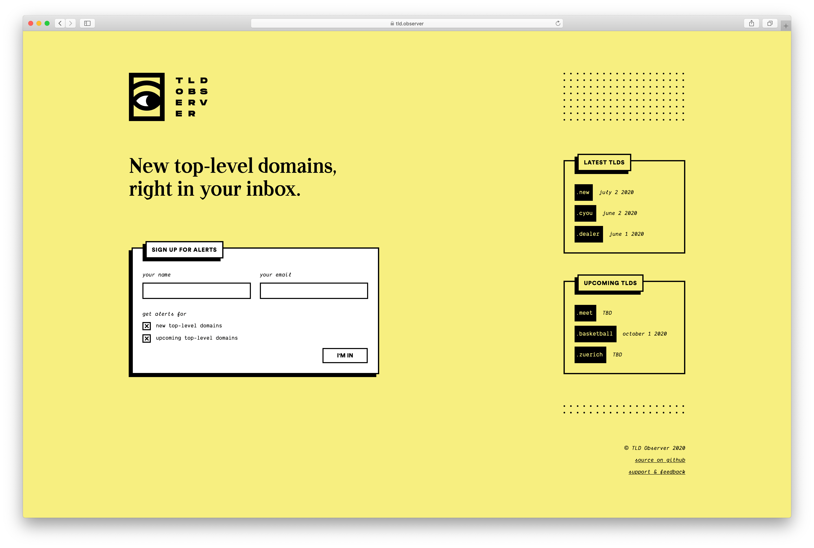

# TLD Observer

New top-level domains, right in your inbox.

[https://tld.observer](https://tld.observer/)

## About

TLD Observer allows you to subscribe to email notifications for new top-level domains. Users can choose to be notified
of newly-released TLDs, soon-to-be-released TLDs, or both.

**It comprises 4 main components:**

- 👷&nbsp; A cronjob-based worker process to detect new TLDs and save data about them
- 🚀&nbsp; A static website generator that will publish a new version of the website when new TLD data is saved
- 👩‍💻&nbsp; A public API allowing users to register to get email notifications
- 📬&nbsp; An email delivery service to send notifications based on both user and TLD data

## Tech stack

**⚙️&nbsp; Back-end built with:**

- [TypeScript](https://www.typescriptlang.org/)
- [Node](https://nodejs.org/)
- [Express](https://www.express.com/)
- [Massive](https://massivejs.org/)
- [PostgreSQL](https://www.postgresql.org/)
- [RabbitMQ](https://www.rabbitmq.com/)
- [Heroku](https://heroku.com/)
- [Mailgun](https://www.mailgun.com/)

**💅&nbsp; Front-end built with:**

- [TypeScript](https://www.typescriptlang.org/)
- [React](https://reactjs.org/)
- [Styled-components](https://styled-components.com/)
- [Gatsby](https://www.gatsbyjs.org/)
- [GraphQL](https://graphql.org/)
- [Netlify](https://www.netlify.com/)

**🛠️&nbsp; Other tools:**

- [Cloudflare](https://www.cloudflare.com/)
- [Sumo Logic](https://www.sumologic.com/)
- [JWT](https://jwt.io/)
- [db-migrate](https://db-migrate.readthedocs.io/)
- [Yup](https://github.com/jquense/yup)
- [Postman](https://www.postman.com/)
- [ESLint](https://eslint.org/)
- [Prettier](https://prettier.io/)

## Architecture

TODO
