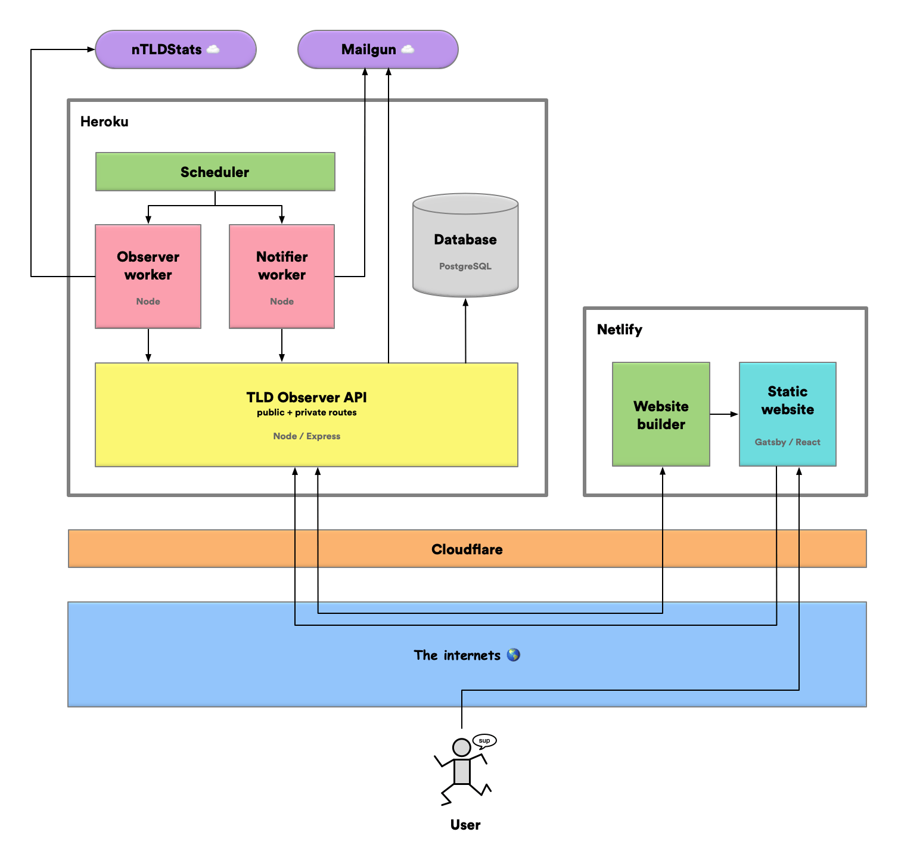
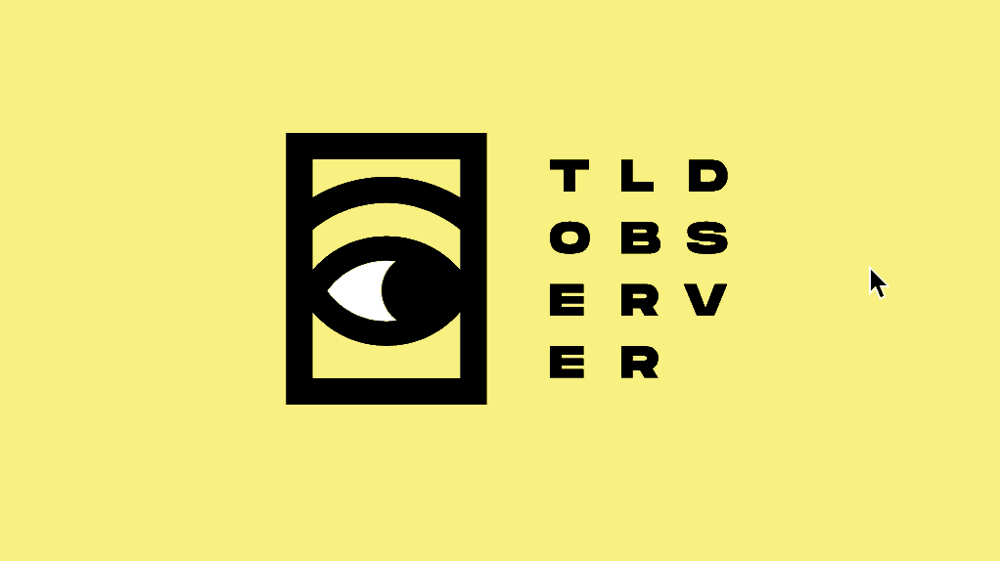
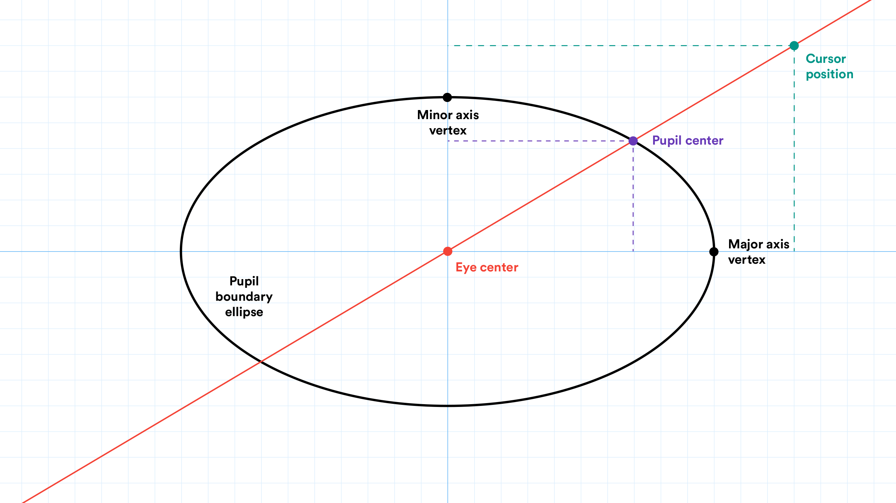
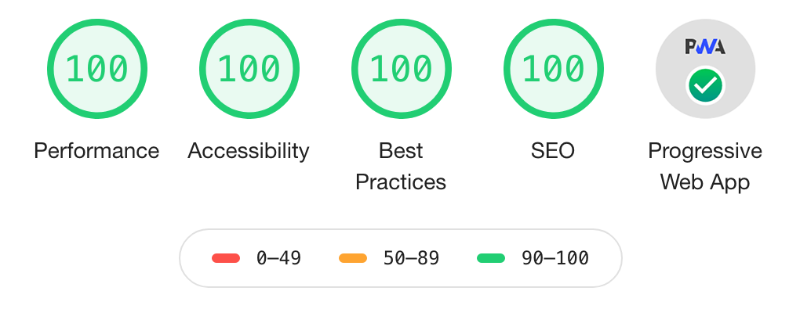
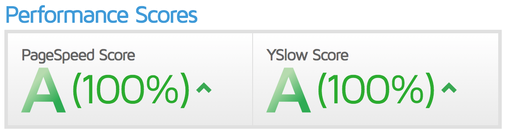

# TLD Observer

New top-level domains, right in your inbox.

[https://tld.observer](https://tld.observer/)

## About

TLD Observer allows you to subscribe to email notifications for new top-level domains. Users can choose to be notified
of newly-released TLDs, soon-to-be-released TLDs, or both.

**It comprises 4 main components:**

- 👷&nbsp; A cronjob-based worker process to detect new TLDs and save data about them
- 🚀&nbsp; A static website generator that will publish new website versions when new TLD data is saved
- 👩‍💻&nbsp; A public API allowing users to register to get email notifications
- 📬&nbsp; An email delivery service to send notifications based on both user and TLD data

## Tech stack

**⚙️&nbsp; Back-end built with:**

- [TypeScript](https://www.typescriptlang.org/)
- [Node](https://nodejs.org/)
- [Express](https://www.express.com/)
- [Massive](https://massivejs.org/)
- [PostgreSQL](https://www.postgresql.org/)
- [Heroku](https://heroku.com/)
- [Mailgun](https://www.mailgun.com/)

**💅&nbsp; Front-end built with:**

- [TypeScript](https://www.typescriptlang.org/)
- [React](https://reactjs.org/)
- [Styled-components](https://styled-components.com/)
- [Gatsby](https://www.gatsbyjs.org/)
- [GraphQL](https://graphql.org/)
- [Netlify](https://www.netlify.com/)

**🛠️&nbsp; Other tools:**

- [Cloudflare](https://www.cloudflare.com/)
- [Sumo Logic](https://www.sumologic.com/)
- [JWT](https://jwt.io/)
- [db-migrate](https://db-migrate.readthedocs.io/)
- [Jest](https://jestjs.io/)
- [Yup](https://github.com/jquense/yup)
- [Postman](https://www.postman.com/)
- [Adobe Illustrator](https://www.adobe.com/products/illustrator.html)
- [OmniGraffle](https://www.omnigroup.com/omnigraffle/)

## Architecture

## Eye animation

  

The eye logo will move according to your cursor when you visit TLD Observer on a computer. Pretty cool right?

In order to have a realistic pupil position no matter where your cursor is located, a math equation is repeatedly solved
as you move your cursor around: We find the intersection of the line that goes through both your cursor position and
the center of the eye and of an arbitrary ellipse defining the boundaries of the pupil. 🤓

## Reviews and awards

  
  
“A masterpiece. 5 green circles.” - <em>Google Lighthouse</em>

  
&nbsp;

  
  
“LGTM 👍” - <em>YSlow</em>

  
&nbsp;

  
“Yep, it seems fine.” - <em>Dareboost</em>

  
&nbsp;

  
“Works well. Fonts look a little weird, but I'm used to it by now.” - <em>Internet Explorer</em>

  
&nbsp;

  
“Wow, it fits!” - <em>iPhone 5</em>

  
&nbsp;

## Support and feedback

Shoot my an email at [tldobserver@pascalgiguere.dev](mailto:tldobserver@pascalgiguere.dev).
